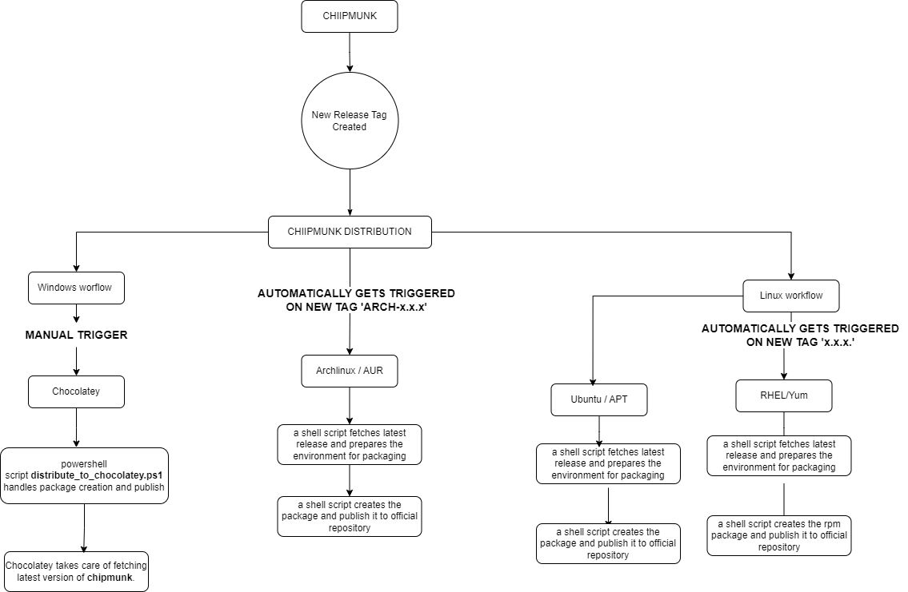

<p align="center">
  <a href="" rel="noopener">
 </a>
</p>

<h3 align="center">Chipmunk Distribution</h3>

<div align="center">

  []() 
  [](/LICENSE)

</div>

---

<p align="center"> Chipmunk distribution repository automates the packaging and distribution process for multiple platform dependent distros.
    <br> 
</p>

## 📝 Table of Contents
- [About](#about)
- [General Workflow](#workflows)
- [Getting Started](#getting_started)
- [Current State](#current_state)
- [Authors](#authors)

## About <a name = "about"></a>

Chipmunk Distribution – a repository for packaging and distributing latest releases of [Chipmunk](https://github.com/esrlabs/chipmunk/releases)!

Thanks to GitHub Actions, we are able to bring you the latest releases packaged and ready for the official repositories.

## 🌟 General Workflow <a name = "workflows"></a>

---



---

1. **Windows**

    For Windows package manager (Chocolatey), distribution was manually triggered and only done once. Chocolatey takes care of fetching latest version of chipmunk so we don't need to make any updates on release.

2. **MacOS**

    We have no workflows for this distribution because chipmunk is already registered to brew. More information [here](https://formulae.brew.sh/cask/chipmunk).

3. **Linux**

    For Linux package managers all workflows have a common structure such as:

    1. ***Prepare environment:***
        - setup operating system for the action
        - installation of any required build dependencies
        - get/download latest chipmunk release

    2. ***Build package:***
        - create/build of the distro package
        
    3.  ***Publish package:***
        - register cretead package to official repository
        - upload a copy to chipmunk releases

    To implement this structure we are wrapping this steps in scripts (bash, shell, make or python).  

    Linux workflow is automatically triggered by the release workflow from [chipmunk](https://github.com/esrlabs/chipmunk/blob/master/.github/workflows/release.yml) which pushes tag to [chipmunk-distribution](https://github.com/esrlabs/chipmunk-distribution/blob/master/.github/workflows/release.yml).
    
    ❗ Arch Linux package has it's own worflow and is triggered by dfferent tag then the other linux packages. [chipmunk](https://github.com/esrlabs/chipmunk/blob/master/.github/workflows/release.yml) pushes special tag "arch-x.x.x" (arch folowed by version).


### Prerequisites
Before you dive into contributing make sure you do the following:

1. **Request Access to GitHub Secrets:**
   - Reach out to our team or maintainers to get access to the GitHub repository's Secrets section.

2. **Add Token to GitHub Secrets:**
   - In your forked repository, go to "Settings" -> "Secrets."
   - Click on "New repository secret" and name it like `CHIPMUNK_TOKEN`.
   - Paste your copied token as the secret's value and save.


## 🏁 Getting started <a name = "getting_started"></a>
These instructions will get you a copy of the project up and running on your local machine for development.

1. **Fork the Repository**: Click on the "Fork" button at the top right of this page to create your copy of the repository.

2. **Clone Your Fork**: Clone your forked repository to your local machine.

    ```bash
    git clone https://github.com/your-username/your-distribution-repo.git
    cd your-distribution-repo
    ```

3. **Add your changes**: Follow the repository tree and use the following structure when addding a new package:
    
    ```
        ├───package_manager
        │   ├───dir1
        │   │   ├───patches
        │   │   └───source
        │   └───scripts
    ```

4. **Use common resources**: common folder contain scripts which must be reused inside your logic when adding a new package.

5. **Update workflows**: In case of a new linux package manager update `.github/workflows/distribute_linux.yml`.

6. **Create Pull Request**: Once you're satisfied with your changes, create a pull request to submit them for review.


## 🚀 Current State <a name = "current_state"></a>

- pacman (arch) ✅ - [@alfr1337](https://github.com/alfr1337)
- brew (mac) ✅ 
- chocolatey (windows) ✅ -[@itsmesamster](https://github.com/itsmesamster) 
- apt (ubuntu, debian) ⛏️ - [@alfr1337](https://github.com/alfr1337)
- dnf (fedora) ⛏️ - [@itsmesamster](https://github.com/itsmesamster)
 
❗ For Debian users we deploy in each [Chipmunk](https://github.com/esrlabs/chipmunk/releases) release the .deb package. Publishing this .deb package to the official apt repository is on review by the debian community and still ongoing. 

## ✍️ Authors <a name = "authors"></a>
- [@alfr1337](https://github.com/alfr1337) - Initial work
- [@itsmesamster](https://github.com/itsmesamster) - Initial work

See also the list of [contributors](https://github.com/esrlabs/chipmunk-distribution/graphs/contributors) who participated in this project. If you have any questions or need further assistance, feel free to contact us.
